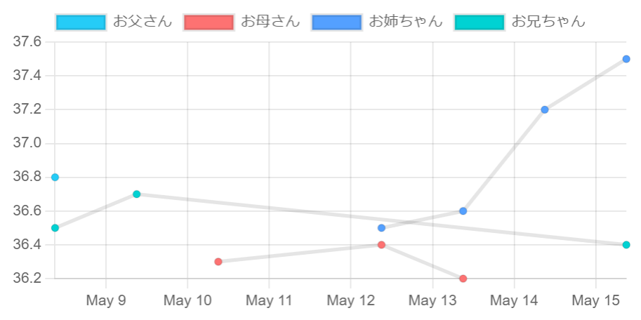

redmine_numericfield_chart_macro
================================

A wiki macro for Redmine ITS; to display a chart of numeric custom field.

# description

In wiki, write this macro like follows:

`{{numericfield_chart(体温, 2, 3, 5)}}`

- first argument: name of custom_field
- rest of arguments: issues id

# Installation

1. Go to your Redmine installation's plugins/ directory.
2. `git clone https://github.com/matobaa/redmine_numericfield_chart_macro`
3. `make` to retrieve required javascript library.
3. Restart Redmine.

# Uninstallation
1. Go to your Redmine installation's plugins/ directory.
2. `rails redmine:plugins:migrate name=redmine_numericfield_chart_macro version=0`
3. `rm -r redmine_numericfield_chart_macro`
